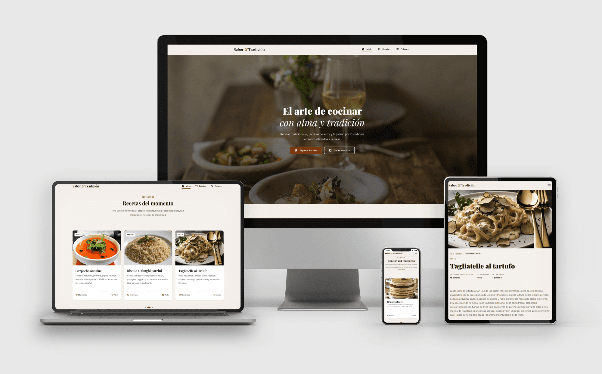

# Sitio Web de Recetas Tradicionales

Proyecto académico de implementación de un sitio web de recetas utilizando herramientas modernas de desarrollo web como: Parcel, TypeScript, Sass, PostHTML.

## Descripción

Sitio web de recetas con generación automática de páginas con los detalles de cada receta. Utiliza un sistema de plantillas HTML modular (PostHTML) junto con preprocesamiento de estilos (Sass) y tipado estricto con TypeScript, todo empaquetado y optimizado mediante Parcel 2.

## Características Principales

- **Generación automática de páginas** de detalle de recetas
- **Sistema de plantillas modular** con PostHTML (con los plugins `extend`, `include`, `expressions`)
- **Estilos con Sass** y arquitectura de componentes
- **TypeScript** para código JavaScript tipado y robusto
- **Hot Module Replacement (HMR)** en modo desarrollo gracias a Parcel
- **Optimización automática** en producción (minificación, tree-shaking) gracias a Parcel
- **Diseño responsive** adaptado a múltiples dispositivos

## Requisitos Previos

Antes de comenzar, asegúrate de tener instalado:

- **Node.js** (versión 18 o superior recomendada)
- **npm** (incluido con Node.js)

## Instalación

1. **Clona el repositorio** o descarga el código fuente:

```bash
git clone https://github.com/rlarreasanchez/tools-html-css-pec.git
```

2. **Instala las dependencias** del proyecto:

```bash
cd tools-html-css-pec
npm install
```

Este comando instalará todas las dependencias especificadas en el archivo `package.json`, incluyendo Parcel, TypeScript, Sass, PostHTML y sus plugins, etc...

## Entorno de Desarrollo

Para iniciar el entorno de desarrollo hay que ejecutar el siguiente comando:

```bash
npm start
```

Este comando ejecuta la siguiente secuencia:

1. **Limpia** directorios anteriores (`dist` y `.parcel-cache`)
2. **Genera las páginas de recetas** automáticamente desde los archivos JSON
3. **Inicia el servidor de desarrollo** con el bundler Parcel

El servidor estará disponible en: **http://localhost:1234**

### Archivos importantes

- **HTML**: Archivos en `src/pages/`, `src/layouts/` y `src/partials/`
- **Estilos**: Archivos `.scss` en `src/styles/`
- **Scripts**: Archivos `.ts` en `src/ts/`
- **Recetas**: Archivos `.json` en `src/data/recipes/`
- **Imágenes**: Archivos en `src/images/`

> **Nota**: Si modificas archivos JSON de recetas, deberás **reiniciar el servidor** de desarrollo para regenerar las páginas HTML correspondientes.

## Entorno de Producción

Para generar una versión optimizada del sitio web lista para producción:

```bash
npm run build
```

Este comando:

1. **Limpia** directorios anteriores
2. **Genera las páginas de recetas**
3. **Compila y optimiza** todos los archivos

### Resultado

Los archivos optimizados se generan en la carpeta **`dist/`**, que contiene:

- Páginas HTML minificadas
- CSS compilado y minificado
- JavaScript transpilado y minificado
- Imágenes optimizadas
- Archivos estáticos con nombres hasheados

Puedes desplegar el contenido de la carpeta `dist/` en cualquier servidor web estático

Puedes ver el resultado en la página web:
[https://tools-html-css-pec.netlify.app/](https://tools-html-css-pec.netlify.app/)

## Autor

**Rafael Larrea Sánchez**

## Licencia

Este proyecto está licenciado bajo la Licencia MIT. Consulte el archivo [LICENSE](LICENSE) para obtener más información.

---

Desarrollado como proyecto académico para el **Máster Universitario en Desarrollo de Sitios Web** - Asignatura: Herramientas HTML y CSS
